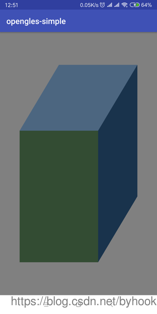

## android平台opengles3.0实践学习

- [android平台下OpenGLES3.0从零开始](https://github.com/byhook/opengles4android/blob/master/readme/android平台下OpenGLES3.0从零开始.md)
- [android平台下OpenGLES3.0绘制纯色背景](https://github.com/byhook/opengles4android/blob/master/readme/android平台下OpenGLES3.0绘制纯色背景.md)
- [android平台下OpenGLES3.0绘制圆点、直线和三角形](https://github.com/byhook/opengles4android/blob/master/readme/android平台下OpenGLES3.0绘制圆点、直线和三角形.md)
- [android平台下OpenGLES3.0绘制彩色三角形](https://github.com/byhook/opengles4android/blob/master/readme/android平台下OpenGLES3.0绘制彩色三角形.md)
- [android平台下OpenGLES3.0从矩形中看矩阵和正交投影](https://github.com/byhook/opengles4android/blob/master/readme/android平台下OpenGLES3.0从矩形中看矩阵和正交投影.md)
- [android平台下OpenGLES3.0着色语言基础知识(上)](https://github.com/byhook/opengles4android/blob/master/readme/android平台下OpenGLES3.0着色语言基础知识上.md)
- [android平台下OpenGLES3.0着色语言基础知识(下)](https://github.com/byhook/opengles4android/blob/master/readme/android平台下OpenGLES3.0着色语言基础知识下.md)
- [android平台下OpenGLES3.0实例详解顶点属性、顶点数组](https://github.com/byhook/opengles4android/blob/master/readme/android平台下OpenGLES3.0实例详解顶点属性、顶点数组.md)
- [android平台下OpenGLES3.0实例详解顶点缓冲区对象(VBO)和顶点数组对象(VAO)](https://github.com/byhook/opengles4android/blob/master/readme/android平台下OpenGLES3.0实例详解顶点缓冲区对象VBO和顶点数组对象VAO.md)
- [android平台下OpenGLES3.0绘制立方体的几种方式](https://github.com/byhook/opengles4android/blob/master/readme/android平台下OpenGLES3.0绘制立方体的几种方式.md)
- [android平台下OpenGLES3.0实现2D纹理贴图显示bitmap](https://github.com/byhook/opengles4android/blob/master/readme/android平台下OpenGLES3.0实现2D纹理贴图显示bitmap.md)
- [android平台下OpenGLES3.0使用GLSurfaceView对相机Camera预览实时处理](https://github.com/byhook/opengles4android/blob/master/readme/android平台下OpenGLES3.0使用GLSurfaceView对相机Camera预览实时处理.md)
- [android平台下OpenGLES3.0使用TextureView对相机Camera预览实时处理](https://github.com/byhook/opengles4android/blob/master/readme/android平台下OpenGLES3.0使用TextureView对相机Camera预览实时处理.md)
- [android平台下基于ANativeWindow实现渲染bitmap对象](https://github.com/byhook/opengles4android/blob/master/readme/android平台下基于ANativeWindow实现渲染bitmap对像.md)

## 效果预览

    
    

    
    

