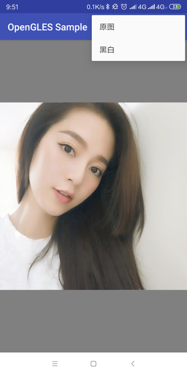
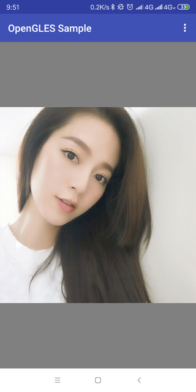
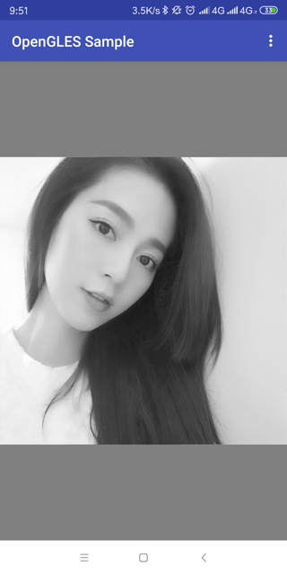

## 概述

之前了解的一些第三方库，各种动态切换滤镜，比较神奇，于是自己研究了一番，基础原理倒也不是很难，下面记录一下过程

## 配置环境

操作系统：`ubuntu 16.05`

## 效果预览

<div>
    
    
    
</div>

## 实现方案

笔者这里封装了一个渲染控件`GLView`，继承自`GLSurfaceView`

```java
/**
 * @anchor: andy
 * @date: 2019-03-27
 * @description:
 */
public class GLView extends GLSurfaceView implements IFilter {

    private FilterRenderer mGLRender;

    public GLView(Context context) {
        this(context, null);
    }

    public GLView(Context context, AttributeSet attrs) {
        super(context, attrs);
        setupSurfaceView();
    }

    private void setupSurfaceView() {
        //设置版本
        setEGLContextClientVersion(3);
        mGLRender = new FilterRenderer();
        setRenderer(mGLRender);

        try {
            requestRender();
        } catch (Exception e) {
            e.printStackTrace();
        }
    }

    /**
     * 设置滤镜
     * 滤镜由于可能存在多种类型
     * 这里抽象了一个基础的滤镜类
     * @param baseFilter
     */
    @Override
    public void setFilter(BaseFilter baseFilter) {
        if (mGLRender != null) {
            mGLRender.setFilter(baseFilter);
        }
    }
}
```

**抽象类BaseFilter的实现**

```java
public abstract class BaseFilter {

    /**
     * 滤镜类型声明
     */
    interface FilterType {

        int TYPE_ORIGIN = 0;

        int TYPE_GRAY = 1;

    }

    /**
     * 获取滤镜类型
     *
     * @return
     */
    public abstract int getType();

    /**
     * 获取滤镜数据
     *
     * @return
     */
    public abstract float[] getFilter();

}
```

笔者这里以黑白滤镜为例：

```java
/**
 * @anchor: andy
 * @date: 2019-03-27
 * @description:
 */
public class GrayFilter extends BaseFilter {

    @Override
    public int getType() {
        return FilterType.TYPE_GRAY;
    }

    @Override
    public float[] getFilter() {
        return new float[]{0.299f, 0.587f, 0.114f};
    }

}
```

看到这里，你肯定很疑惑，这里`getFilter`返回的`float数组`是怎么来的，不用急，先往下看

还记得之前入门的一些博客内容吗？笔者之前也写过一些简单的片段着色器：

```java
#version 300 es
precision mediump float;
uniform sampler2D uTextureUnit;
in vec2 vTexCoord;
out vec4 vFragColor;
void main() {
     vFragColor = texture(uTextureUnit,vTexCoord);
}
```

但是这个着色器只能输出原图的数据，那么我们应该如何更改输出之后的数据呢？这个时候我们就需要动态的修改`统一变量`

```java
#version 300 es
precision mediump float;
uniform sampler2D uTextureUnit;
//传入滤镜类型
uniform int vFilterType;
//传入滤镜数据
in vec3 vFilter;
in vec2 vTexCoord;

//输出
out vec4 vFragColor;
void main() {
     vec4 vTextureColor = texture(uTextureUnit,vTexCoord);
     switch(vFilterType){
        case 1:
            //黑白滤镜
            float vFilterColor = (vFilter.x * vTextureColor.r + vFilter.y * vTextureColor.g + vFilter.z * vTextureColor.b);
            vFragColor = vec4(vFilterColor, vFilterColor, vFilterColor, 1.0);
            break;
        case 0:
            //默认原图
        default:
            //原图显示
            vFragColor = vTextureColor;
            break;
     }
}
```
上面的例子，相信有`C语言基础`的基本都能看懂，大致意思就是暴露


项目地址：[sample-filter](https://github.com/byhook/opengles4android)

https://github.com/byhook/opengles4android
